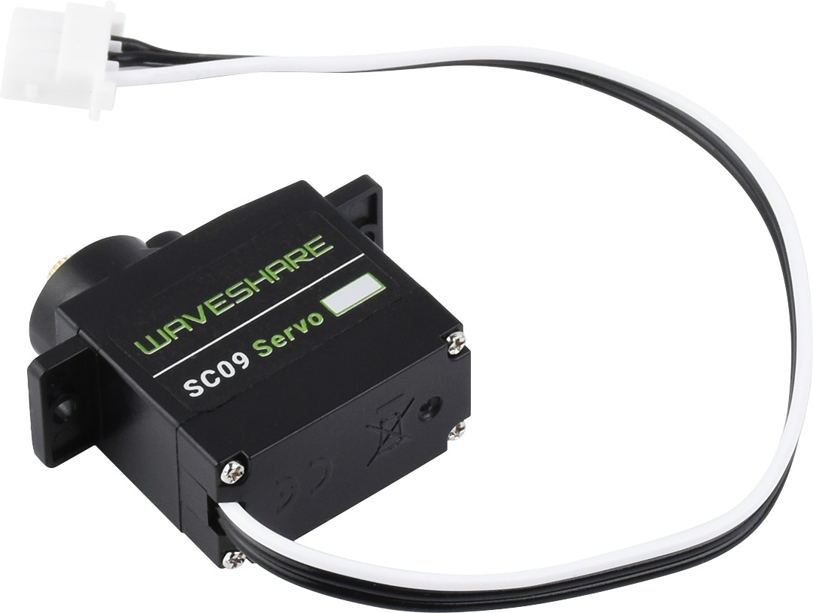
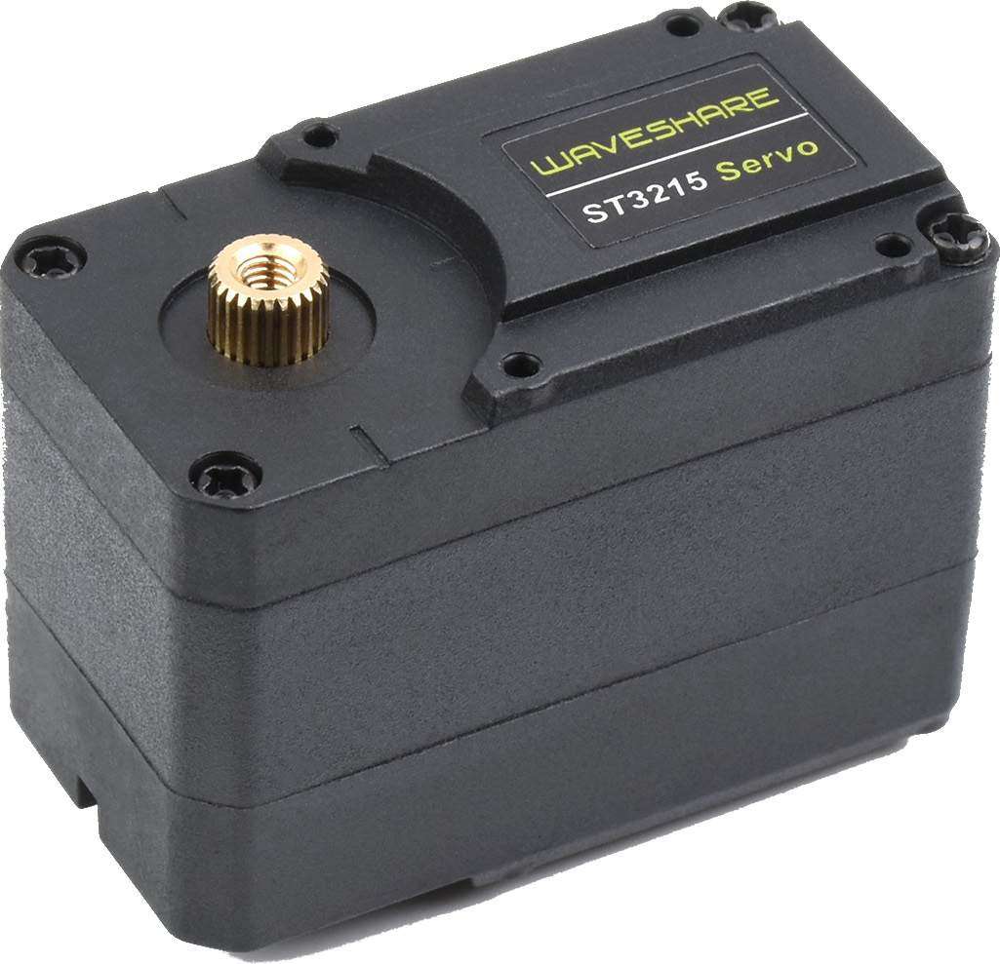
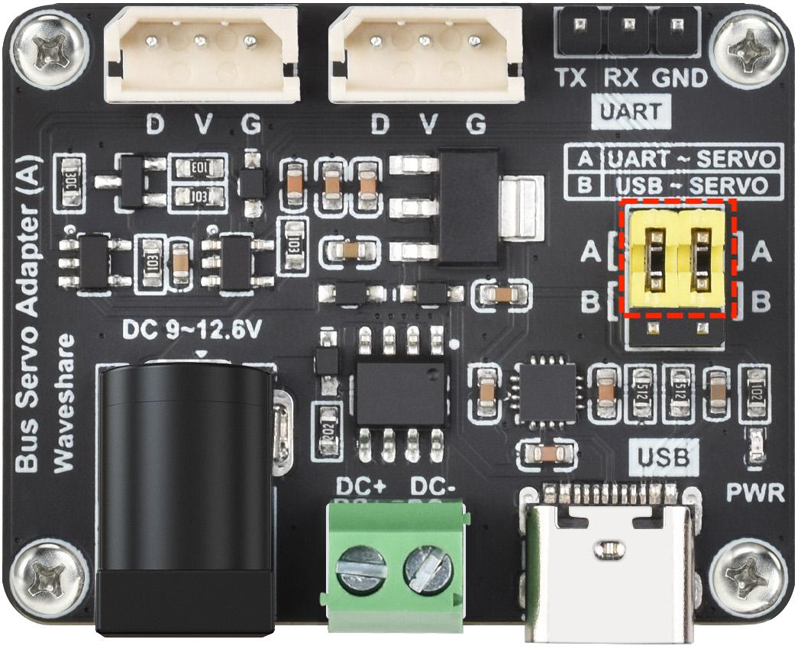
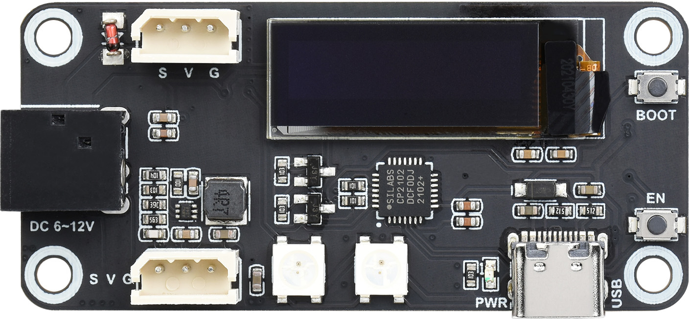

# STservo Driver

* Waveshare sells SC-series and ST-series servos and their wired and wireless drivers.
* I found its [official python SDK](./misc/SCServo_Python.zip) is a piece of sh*t so I write this version of driver for myself and the learner.
* Keeping thing in one place and in a minimalist style shows your good faith for other devs!

<table  style="vertical-align: middle; text-align: center;">
    <tr>
        <td>Product Link</td>
        <td>
            <a href='https://www.waveshare.net/wiki/SC09_Servo'>SC09 (6-8.4V)</a>
        </td>
        <td>
            <a href='https://www.waveshare.net/wiki/ST3215_Servo'>ST3215 (6-12V)</a>
        </td>
    </tr>
    <tr>
        <td>Thumbnail</td>
        <td></img></td>
        <td></img></td>
    </tr>
    <tr>
        <td>Product Link</td>
        <td><a href='https://www.waveshare.net/wiki/Bus_Servo_Adapter_(A)'>Bus Servo Adapter (A)</a></td>
        <td><a href='https://www.waveshare.net/wiki/Servo_Driver_with_ESP32'>Servo Driver with ESP32</a></td>
    </tr>
    <tr>
        <td>Thumbnail</td>
        <td></img></td>
        <td></img></td>
    </tr>
</table>

## Bus Servo Adapter (A) Spec

* 输入电压 input voltage：< 12.6V（输入电压需要与舵机电压匹配 the voltage supplied to the driver board may be in the voltage range of the servo.）
* 通信接口 comm protocol：UART
* 供电接口 power jack：5.5*2.1mm DC
* 产品尺寸 measurement：42mm x 33mm
* 固定孔通径 diameter of mounting hole：2.5mm 
* 适用舵机 compatible servo：多达up to 253个ST/SC系列总线舵机

## Servo Driver with ESP32 Spec

* 输入电压VIN：6V~12V（输入电压需要与舵机电压匹配）
* 主控芯片：ESP32
* 控制方式：UART (U0RX/U0TX)
* 下载接口：Type-C
* 供电接口：5.5*2.1mm DC
* 产品尺寸：65mm x 30mm
* 固定孔通径：3.0mm
* 显示屏：SSD1306
* LED: WS2812
* Flash Config
  * Upload Speed: "921600"
  * CPU Frequency: "240MHz(WiFi/BT)"
  * Flash Frequency: "80MHz"
  * Flash Mode: "QIO"
  * Flash Size: "4MB(32Mb)"
  * Partition Scheme: "Huge APP(3MB No OTA/1MB SPIFFS)"
  * PSRAM: "Enabled"

  ```cpp
  // the U1RX/U1TX used to control servos.
  // GPIO 18 - S_RXD, GPIO 19 - S_TXD, as default.
  // Serial1.begin(1000000, SERIAL_8N1, S_RXD, S_TXD);
  #define SERVO_RXD_PIN 18
  #define SERVO_TXD_PIN 19
  
  // SSD1306显示器配置/引脚定义
  #define SSD1306_SDA_PIN         21      // I2C数据引脚
  #define SSD1306_SCL_PIN         22      // I2C时钟引脚
  #define SSD1306_SCREEN_WIDTH    128     // OLED显示宽度
  #define SSD1306_SCREEN_HEIGHT   32      // OLED显示高度
  #define SSD1306_OLED_RESET      -1      // 重置引脚 (-1表示不使用)
  #define SSD1306_SCREEN_ADDRESS  0x3C    // I2C地址
  
  // WS2812B LED引脚定义
  #define WS2812B_LED_PIN         23      // WS2812B数据引脚
  #define WS2812B_NUM_LEDS        2       // LED数量
  ```

## 接线方式

* UART: <b style='color:red'>Tx-Tx, Rx-Rx</b>
* USB

## ~~SDK~~

* ~~Waveshare provides two python SDKs [STServo_Python.zip](https://www.waveshare.net/wiki/%E6%96%87%E4%BB%B6:STServo_Python.zip) and [SCServo_Python.zip](https://www.waveshare.net/wiki/%E6%96%87%E4%BB%B6:SCServo_Python.zip), but only SCServo_Python is needed.~~

### Usage
